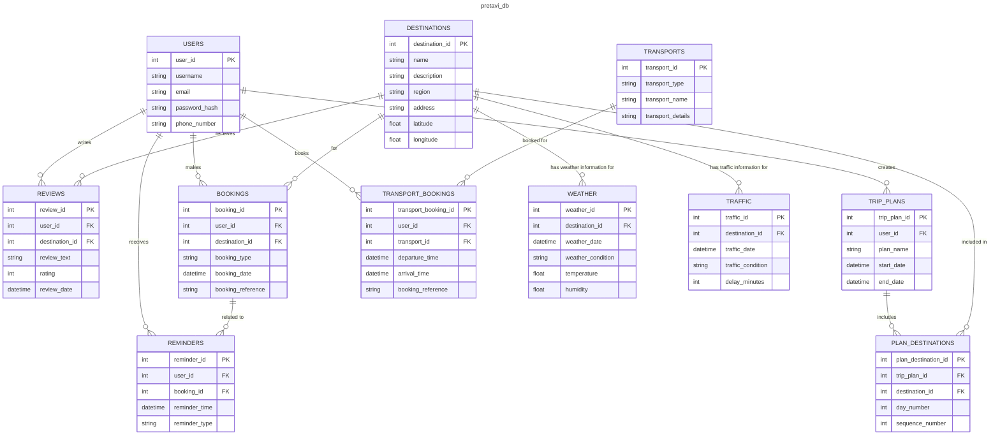

# ER図

# pretavi_db

```mermaid
---
title: "pretavi_db"
---
erDiagram
    USERS {
        int user_id PK
        string username
        string email
        string password_hash
        string phone_number
    }

    DESTINATIONS {
        int destination_id PK
        string name
        string description
        string region
        string address
        float latitude
        float longitude
    }

    REVIEWS {
        int review_id PK
        int user_id FK
        int destination_id FK
        string review_text
        int rating
        datetime review_date
    }

    TRIP_PLANS {
        int trip_plan_id PK
        int user_id FK
        string plan_name
        datetime start_date
        datetime end_date
    }

    PLAN_DESTINATIONS {
        int plan_destination_id PK
        int trip_plan_id FK
        int destination_id FK
        int day_number
        int sequence_number
    }

    BOOKINGS {
        int booking_id PK
        int user_id FK
        int destination_id FK
        string booking_type
        datetime booking_date
        string booking_reference
    }

    REMINDERS {
        int reminder_id PK
        int user_id FK
        int booking_id FK
        datetime reminder_time
        string reminder_type
    }

    TRANSPORTS {
        int transport_id PK
        string transport_type
        string transport_name
        string transport_details
    }

    TRANSPORT_BOOKINGS {
        int transport_booking_id PK
        int user_id FK
        int transport_id FK
        datetime departure_time
        datetime arrival_time
        string booking_reference
    }

    WEATHER {
        int weather_id PK
        int destination_id FK
        datetime weather_date
        string weather_condition
        float temperature
        float humidity
    }

    TRAFFIC {
        int traffic_id PK
        int destination_id FK
        datetime traffic_date
        string traffic_condition
        int delay_minutes
    }

    USERS ||--o{ REVIEWS : "writes"
    DESTINATIONS ||--o{ REVIEWS : "receives"
    USERS ||--o{ BOOKINGS : "makes"
    DESTINATIONS ||--o{ BOOKINGS : "for"
    USERS ||--o{ TRIP_PLANS : "creates"
    TRIP_PLANS ||--o{ PLAN_DESTINATIONS : "includes"
    DESTINATIONS ||--o{ PLAN_DESTINATIONS : "included in"
    USERS ||--o{ REMINDERS : "receives"
    BOOKINGS ||--o{ REMINDERS : "related to"
    USERS ||--o{ TRANSPORT_BOOKINGS : "books"
    TRANSPORTS ||--o{ TRANSPORT_BOOKINGS : "booked for"
    DESTINATIONS ||--o{ WEATHER : "has weather information for"
    DESTINATIONS ||--o{ TRAFFIC : "has traffic information for"
```